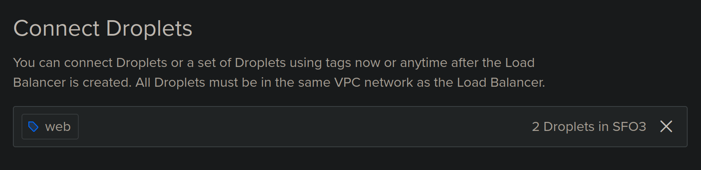

# Assignment-3-Part-2-NGINX

## Introduction

In this assignment, you will extend your previous NGINX setup by configuring two new servers and a load balancer. You will create two Digital Ocean droplets running Arch Linux, set up a load balancer to distribute traffic, clone updated starter code, and update the server configuration to include a file server. This will ensure that your web application is highly available and can serve documents from both servers. The list below is all the tasks to be completed during this assignment.

- Create two Arch Linux droplets tagged "web".

- Create a public-facing load balancer to distribute traffic between the two servers.
    - **Region**: SFO3
    - **VPC**: Default
    - **Tag**: "web"

- Clone the updated starter code repository containing a script to generate an HTML document.

- Update server configuration to include a file server accessible at `your-ip/documents`.
```
/var/lib/webgen
├── bin/
│   └── generate_index
├── documents/
│   ├── file-one
│   └── file-two
└── HTML/
    └── index.html
```
- `index.html` is generated by `generate_index`.
- `file-one` and `file-two` are sample files.


# Table of Contents
- [Introduction](#introduction)
- [Table of Contents](#table-of-contents)
- [Task 1: Create Two New Digital Ocean Droplets](#task-1-create-two-new-digital-ocean-droplets)
- [Task 2: Create a Load Balancer](#task-2-create-a-load-balancer)
- [Task 3: Clone the Updated Starter Code](#task-3-clone-the-updated-starter-code)
- [Task 4: Update NGINX Configuration](#task-4-update-nginx-configuration)
- [Task 5: Verify the New Droplets Page](#task-5-verify-the-new-droplets-page)
- [Congratulations](#congratulations)


## Task 1: Create Two New Digital Ocean Droplets

Create two new Digital Ocean droplets running Arch Linux with the tag "web". You will use this tag when you set up your load balancer.

1. Navigate to the "Droplets" section in the control panel.
2. Click on the "Create Droplet" button.
3. Choose "Arch Linux" as the operating system.
4. Select the droplet size based on your requirements (e.g., Standard, General Purpose).
5. Make sure to choose the data center region of SFO3 (San Francisco Datacenter 3). 
---

---

6. Under "Authentication", select your preferred method (e.g., SSH keys).
7. Add the tag "web" to the droplet.
---


---

8. Repeat the above steps to create the second droplet.
9. Verify that both droplets are running. To verify it should look like the image below with the green indictor meaning its active and the tag web being displayed
---


---


## Task 2: Create a Load Balancer

Create a load balancer to distribute traffic between the two servers created in Task 1. The load balancer should configured with the settings listed below.

2. Navigate to the "Load Balancers" section in the control panel.
3. Click on the "Create Load Balancer" button.
4. Configure the load balancer with the following settings:
    - **Region**: SFO3 (same as your servers)
    - **VPC**: Default (same as your servers)
    - **Type**: External (public)
5. Under "Forwarding Rules", set the following to these, but they should already be the default settings.
    - **Protocol**: HTTP
    - **Port**: 80
    - **Target Protocol**: HTTP
    - **Target Port**: 80
6. Under "Backend", use the "web" tag to load balance all servers with the "web" tag in the SFO3 region.
---

---
7. Click on the "Create Load Balancer" button to finalize the setup.
8. Verify that the load balancer have been created. 

>[!NOTE] The load balancer will show that the servers are down until you set up the NGINX servers within the new droplets.


## Task 3: Clone the Updated Starter Code

>[!IMPORTANT] Make sure to repeat the steps in Part 1 in these newly created droplets before continuing.

Clone the updated starter code from the repository. This repository contains an updated script that will generate the updated HTML script.

1. SSH into one of your newly created droplets.

2. Clone the repository using the following command:
    ```sh
    git clone https://git.sr.ht/~nathan_climbs/2420-as3-p2-start
    ```

3. Move the `generate_index` script to the appropriate directory:
    ```sh
    sudo mv 2420-as3-p2-start/generate_index /var/lib/webgen/bin/
    ```

4. Set the necessary permissions for the `generate_index` script:
    ```sh
    sudo chmod +x /var/lib/webgen/bin/generate_index
    ```

5. Create the required directories:
    ```sh
    sudo mkdir -p /var/lib/webgen/documents
    ```

6. Create the required files:
    ```sh
    sudo touch /var/lib/webgen/documents/file-one /var/lib/webgen/documents/file-two
    ```

    ```sh
    sudo touch /var/lib/webgen/HTML/index.html
    ```

7. Set the ownership for the directories and files:
    ```sh
    sudo chown -R webgen:webgen /var/lib/webgen
    ```


    ## Task 4: Update NGINX Configuration

    Update the NGINX configuration to include a new server block that hosts the files from the `/var/lib/webgen/documents` directory.

    1. Open the NGINX configuration file in a text editor:
        ```sh
        sudo nvim /etc/nginx/sites-available/webgen.conf
        ```

    2. Add the following server block to the configuration file:
          ```sh
          server {
                listen 80;
                listen [::]:80;

                server_name localhost.webgen;

                location / {
                     root /var/lib/webgen/HTML;
                     index index.html;
                     try_files $uri $uri/ =404;
                }

                # Handle /documents/ requests
                location /documents {
                     alias /var/lib/webgen/documents/;
                     autoindex on;
                     autoindex_exact_size off;
                     autoindex_localtime on;
                     try_files $uri $uri/ =404;
                }
          }
        ```
       Here's a breakdown of what each part does:

        - `location /documents { ... }`: Defines a location block for the `/documents` URL path.
            - `alias /var/lib/webgen/documents/;`: Sets the directory to serve files from for requests to `/documents`.
            - `autoindex on;`: Enables directory listing if no index file is found.
            - `autoindex_exact_size off;`: Displays file sizes in a human-readable format.
            - `autoindex_localtime on;`: Displays file timestamps in the local time zone.
            - `try_files $uri $uri/ =404;`: Tries to serve the requested URI as a file, then as a directory, and returns a 404 error if neither is found.

    3. Test the NGINX configuration for syntax errors:
        ```sh
        sudo nginx -t
        ```

    4. Reload NGINX in both droplets to apply the changes:
        ```sh
        sudo systemctl reload nginx
        ```

        ## Task 5: Verify the New Droplets Page

        After setting up the NGINX configuration and reloading the service, you need to verify that the new droplets are serving the files correctly and that the load balancer is distributing traffic as expected.

        


        1. Find the load balancer IP address from the Digital Ocean control panel:
            - Navigate to the "Load Balancers" section.
            - Locate your load balancer and copy its public IP address.

        2. Open a web browser and navigate to the load balancer IP address:
            ```sh
            http://load-balancer-ip
            ```

        3. Verify that the `index.html` page is displayed correctly. It should look like this:

        

        4. Navigate to the documents directory to ensure the files are being served:
            ```sh
            http://<load-balancer-ip>/documents
            ```

        5. Verify that the directory listing is displayed and that `file-one` and `file-two` are accessible. It should look like this: 
        
     


## Congratulations

If you see both the `index.html` page and the directory listing for `/documents`, your load balancer is successfully working. Your web application is now available and can host the files.


## References

 